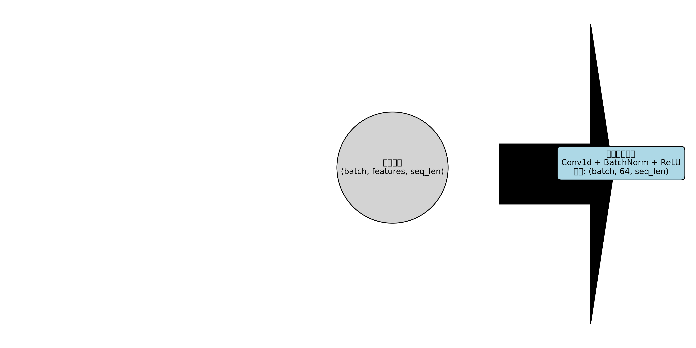

# Hierarchical neural-behavior classification and perturbation analyses

This repository is a public, data-free release of a mouse Barnes-maze neural decoding project. It contains the two-stage Conv-LSTM-Attention model, classical model comparisons, structural ablations, behavior-aligned group-difference figures, masking and perturbation experiments, and neural-model representation analyses.

本仓库是该项目的公开整理版。它保留模型代码、汇总结果和最终图片，但不包含海马脑区原始电生理数据、10 ms/bin 后的数据、行为标签文件、逐样本预测、模型权重或动物级明细表。

## Main model

The model uses 5 s windows sampled at 10 ms per bin, with a 2.5 s step. Only windows with a constant valid behavior label are retained.

The hierarchical decoder has two stages:

1. Stage 1 distinguishes Hole Exploration, Hesitating, and a merged class containing Wrong Hole Exploration, Changing Direction, and Walking.
2. Stage 2 separates the three behaviors inside the merged class.

Each stage uses temporal convolution, a two-layer LSTM, temporal attention, and a fully connected classifier. The final five-class prediction merges both stages.



## Results included

- `results/model`: model comparison, dataset-level results, structural ablation, and the reproduced two-stage baseline.
- `results/group_differences`: ten behavior-aligned two-group figures used in the group-meeting deck, plus a compact p-value index.
- `results/masking`: maximum, mean, and minimum segment replacement; attention shuffling and zeroing; convolution mean replacement; and 50/100/200 ms LSTM shuffling.
- `results/association`: RSA, CKA, decision-geometry, overlap, and frozen-model intervention results.
- `results/window_mechanism`: the L2/L3/L5 window-by-behavior heatmap, architecture-by-perturbation interactions, mechanism contrasts, 500-repeat random-window nulls, L3 Drop/Keep diagnostic, and the stage-wise paired prediction-transition audit (aggregate CC/CW/WC/WW tables, damage/recovery heatmaps, and confusion-matrix deltas). Individual predictions remain private and are not included.
- `figures/raster_examples`: one full raster figure per recording. These are derived figures only; the source spike and label tables are not included.

The reproduced legacy baseline was:

| Metric | Mean ± SD |
|---|---:|
| Accuracy | 74.70 ± 0.70% |
| Recall | 71.85 ± 1.82% |
| F1 | 72.80 ± 1.22% |

The earlier comparison snapshot shown in the presentation reported 77.83% accuracy for the proposed hierarchical model. This value comes from an earlier evaluation snapshot and should not be treated as identical to the later 74.70% reproduced legacy protocol.

## Repository layout

```text
src/
  dual_layer_model/    two-stage Conv-LSTM-Attention training code
  model_comparison/    classical baseline scaffold
  masking/             frozen-model perturbation implementations
  association/         neural-model RSA/CKA analysis
results/               aggregate tables, summaries, and final figures
figures/               model diagram and raster examples
docs/                  experiment map and interpretation notes
```

## Running the model

Install dependencies:

```bash
python -m pip install -r requirements.txt
```

Place private aligned tables under `data/aligned_tables/`. The expected schema is documented in [DATA_AVAILABILITY.md](DATA_AVAILABILITY.md). Then run:

```bash
python src/dual_layer_model/train.py
```

Checkpoints are written to `checkpoints/`, which Git ignores.

## Important interpretation limits

- The reported legacy three-fold result uses stratified random splits of overlapping windows. Training and test windows can share raw time samples, so this result is an internal baseline rather than evidence of cross-animal generalization.
- The later perturbation experiments operate on frozen trained models. They demonstrate sensitivity of the fitted model, not retrained structural necessity.
- The selected two-group p values are exploratory. Multiple tested time points, group regrouping, and the absence of a fully independent animal-level validation set limit causal interpretation.
- Groups 1/2/4/6 and groups 3/5 pool different genotypes and interventions. Their contrast describes phenotype-associated differences and does not isolate an HIF3A causal effect.

See [EXPERIMENT_INDEX.md](docs/EXPERIMENT_INDEX.md) for the mapping between presentation sections and repository artifacts.

The newest window-mechanism conclusions are summarized in Chinese at [`results/window_mechanism/RESULTS_SUMMARY_CN.md`](results/window_mechanism/RESULTS_SUMMARY_CN.md). The matched-null analysis does not support original L2/L5 time-position specificity, so the large replacement effects should be reported as fitted-model sensitivity rather than localized causal evidence.

The historical structural-ablation Table 5 should not be combined with the current three-fold masking baseline. A cell-level provenance audit found that its means and standard deviations mix five-fold and ten-fold summaries and, for some rows, different model classes. Use the coherent three-fold structural table and the stage-wise transition outputs under `results/window_mechanism` for current reporting; retain the older table only as a historical artifact.
